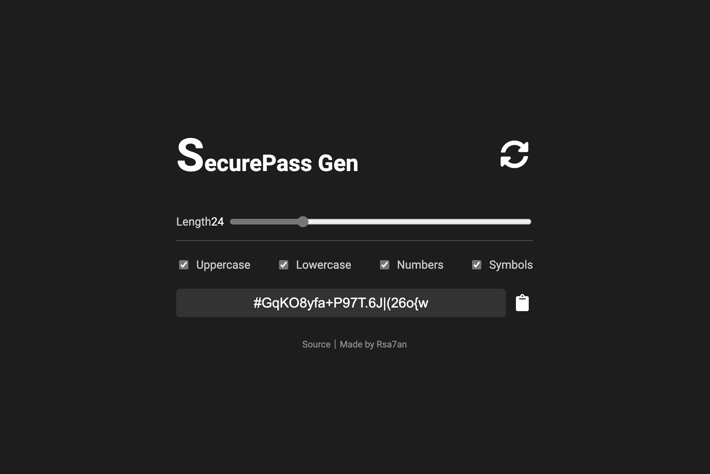

# SecurePass Gen

A secure and customizable password generator built with Vue.js and the Crypto WebAPI. This tool allows users to create strong passwords with various options including length, and the inclusion of uppercase letters, lowercase letters, numbers, and symbols.



## Features

- 🔐**Secure Randomness:** Utilizes the Crypto WebAPI to generate cryptographically secure random numbers.
- ⚙️**Customizable Options:** Users can adjust the password length and choose to include or exclude uppercase letters, lowercase letters, numbers, and symbols.
- 💾**Copy to Clipboard:** Easily copy the generated password to the clipboard with a single click.
- 💭**Responsive Design:** Adaptable layout that works well on different screen sizes.

## Online Version

[https://password.rsa7an.top](https://password.rsa7an.top)

## Getting Started

### Prerequisites

Ensure you have the following installed:

- [Node.js](https://nodejs.org/) (version 12 or higher)
- [Vue CLI](https://cli.vuejs.org/)

### Installation

1. **Clone the repository:**

   ```sh
   git clone https://github.com/yourusername/password-generator.git
   ```

1. **Navigate to the project directory:**

   ```sh
   cd password-generator
   ```

2. **Install dependencies:**

   ```sh
   npm install
   ```

3. **Run the development server:**

   ```sh
   npm run serve
   ```

4. **Open your browser and go to:**

   ```sh
   http://localhost:8080
   ```

## License

Apache-2.0 © [Rsa7an](https://github.com/rsatan)

